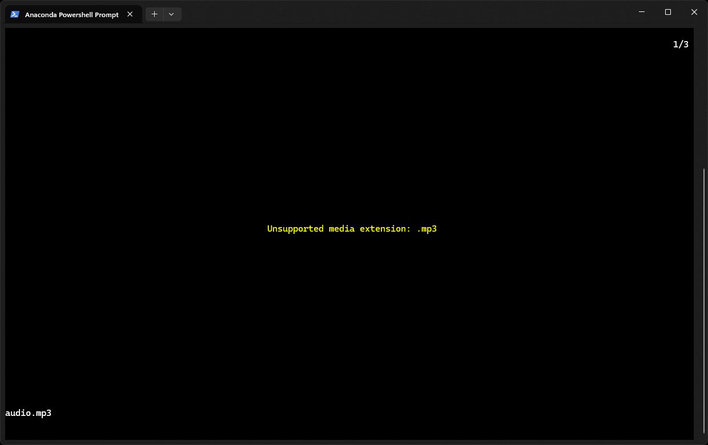
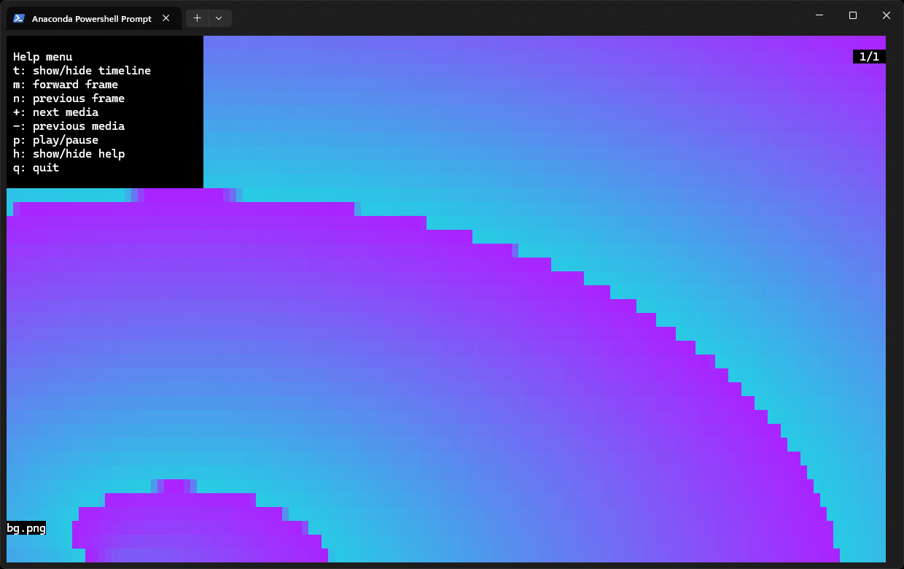
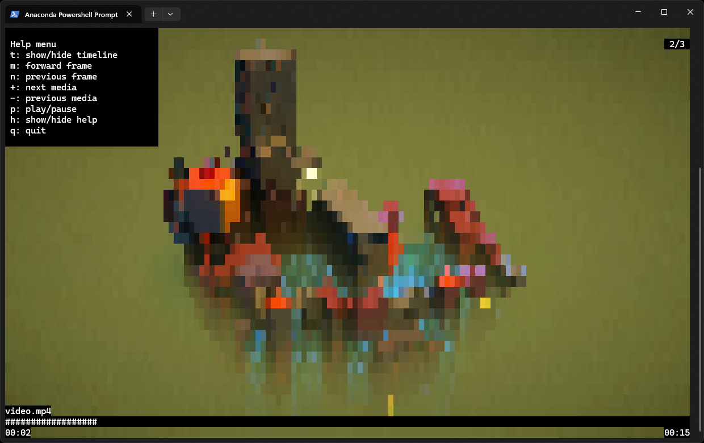
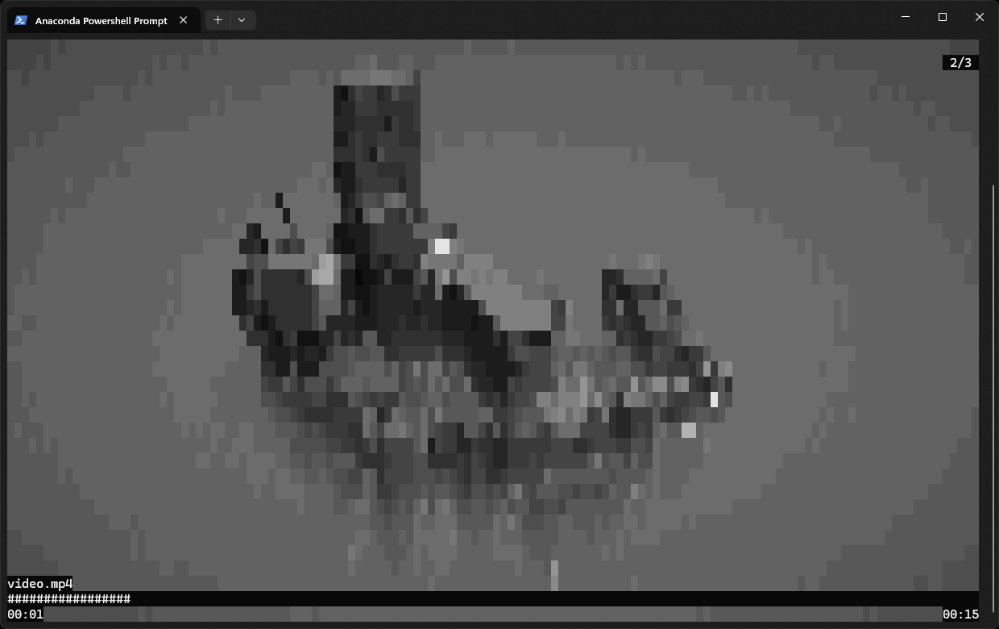

# terminal_viewer 🎥 

<div align="center">
	
</div>

**terminal_viewer** is a simple command line application designed to display media files directly in the terminal. It leverages OpenCV for handling image files and PyAV for video files, ensuring compatibility with a wide range of media formats supported by these libraries. This tool is ideal for users who prefer working within the terminal environment and need a quick way to preview media files without leaving the command line.

## Features
- 🖼️ **Image and Video Support**: Display both images and videos in the terminal.
- 🎨 **Grayscale Option**: View media files in grayscale with a simple flag.
- ⚡ **Lightweight and Fast**: Optimized for quick previews and minimal resource usage.
- 🛠️ **Customizable**: Easily specify multiple files or folders to display.
- 💻 **Terminal-Friendly**: Ideal for users who prefer working within the terminal environment.


## Installation
1. Clone the repository: 
    ``` bash
    git clone https://github.com/Armaggheddon/terminal_viewer.git
    cd terminal_viewer
    ```
1. Install the required dependencies
    ```bash
    pip install -r requirements.txt
    ```
1. Build the python wheel:
    ``` bash
    python .\setup.py sdist bdist_wheel
    ```
1. Depending on your os:
    ``` bash
    # for windows
    pip install .\dist\terminal_viewer-0.1-py3-none-any.whl

    # for MacOS/Linux
    pip install .\dist\terminal_viewer-0.1.tar.gz
    ```
    If the tool is already installed run the above command with `--force-reinstall` option.
1. Launch the application with:
    ```bash
    terminal_viewer --help
    ```

## Usage
The application supports the following arguments:
- `-s`, `--source`: specifies a single media file to be opened. Multiple files can be specified using a space as a separator between paths.
- `-f`, `--folder`: specifies a single folder that can contain 1 or more media files to be displayed. Multiple folders can be specified using a space as a separator between paths.
- `-g`, `--grayscale`: display the media files in grayscale. By default all the media files are shown in RGB 256. 
- `-h`, `--help`: show the available commands with a brief description.

Once the application is launched the following keys can be used to perform specific actions:
- `q`: quits the application.
- `r`: rewinds the current video being played. Works only on videos.
- `m`: goes to the next media if any, or terminates the application if the current media is the last one.
- `n`: goes to the previous media if any, if the current media is the first one behaves like a rewind command. 
- `+`: goes to the next keyframe. Works only on videos.
- `-`: goes to the previous keyframe. Works only on videos.
- `p`: play/pause the current media. Works only on videos. 
- `t`: hides/shows an overlay with the media file name, the current position in the queue of items to be played and, if the media file is a video, the progress bar with the media duration.
- `h`: hides/shows an onverlay with all of the above commands.

<table>
  <tr>
    <td align="center"><br>Unsupported media</td>
    <td align="center"><br>Displaying an image</td>
  </tr>
  <tr align="center">
    <td align="center"><br>Displaying a video</td>
    <td align="center"><br>Displaying media with grayscale</td>
  </tr>
</table>

## Examples
The following examples show how to use the application.

- Display a single image:
    ```bash
    terminal_viewer -s path/to/image.jpg
    ```
- Display a single video:
    ```bash
    terminal_viewer -s path/to/video.mp4
    ```
- Display a single image in grayscale:
    ```bash
    terminal_viewer -s path/to/image.jpg -g
    ```
- Display all the media files in a folder:
    ```bash
    terminal_viewer -f path/to/folder
    ```

### Dependencies

- [OpenCV](https://github.com/opencv/opencv) 📸
- [PyAV](https://github.com/PyAV-Org/PyAV) 🎞️
- [NumPy](https://github.com/numpy/numpy) 🔢